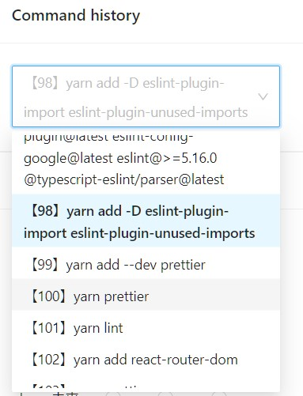

# antd4-multiple-lines-select

Select Component showing multiple lines on Ant Design 4

## Usage

In your file that include `<Select />` and import css just like below,

```JSX:MultiLineSelect.tsx
import React from 'react';
import { Select } from 'antd';
import './MultiLineSelect.css'

const MultiLineSelect = () => (
  <Select
    options={optionData}
  />
);
```

Override antd's style

```CSS:MultiLineSelect.css
.ant-select-selector {
  white-space: pre-wrap;
  height: fit-content !important;
}

.ant-select-selection-item {
  white-space: pre-wrap;
}

.ant-select-item-option-content {
  white-space: pre-wrap;
}
```

## result


